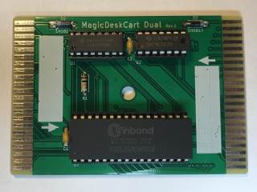

# MagicDeskCart Dual

The MagicDeskCart Dual is a bank switching cartridge for the C64/C128. In reminiscence of the "Double-Ender" cartridges that were produced for the Atari 2600, the MagicDeskCart Dual allows two different sets of banks to be selected by turning the cartridge around.

There is also no warranty whatsoever. **USE AT YOUR OWN RISK!**.

See my [blog post](https://www.hackup.net/2019/07/bank-switching-cartridges/) for more details.

## License

This work is licensed under a
[Creative Commons Attribution-NonCommercial-ShareAlike 4.0 International License](http://creativecommons.org/licenses/by-nc-sa/4.0/).
